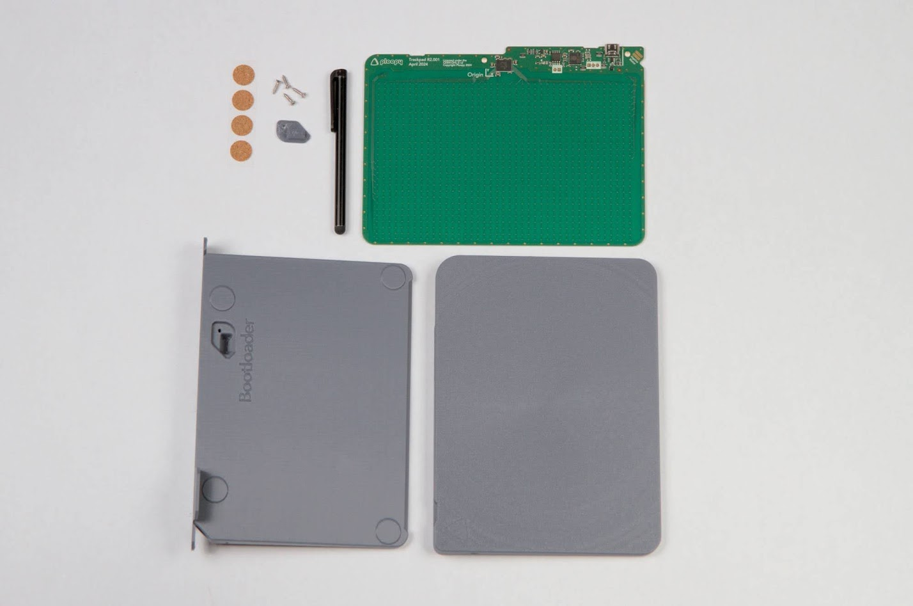
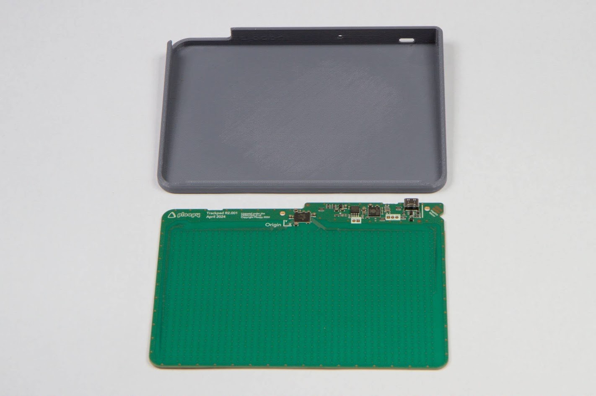
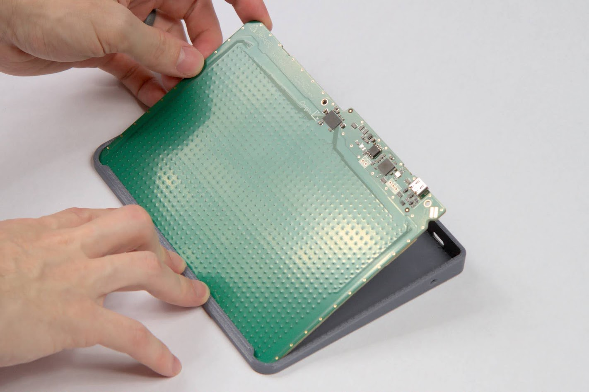
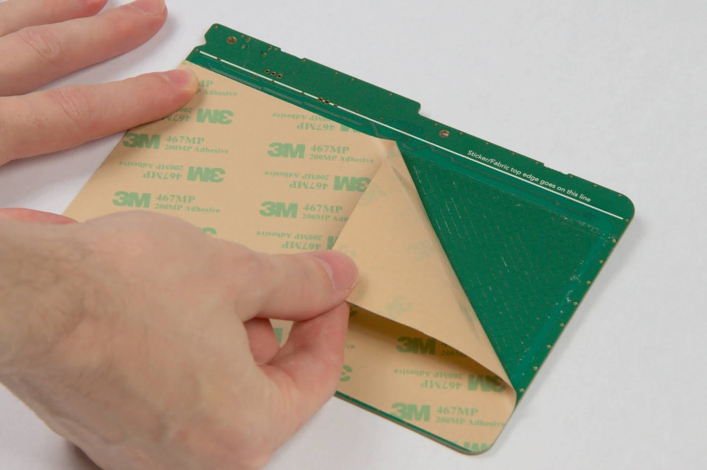
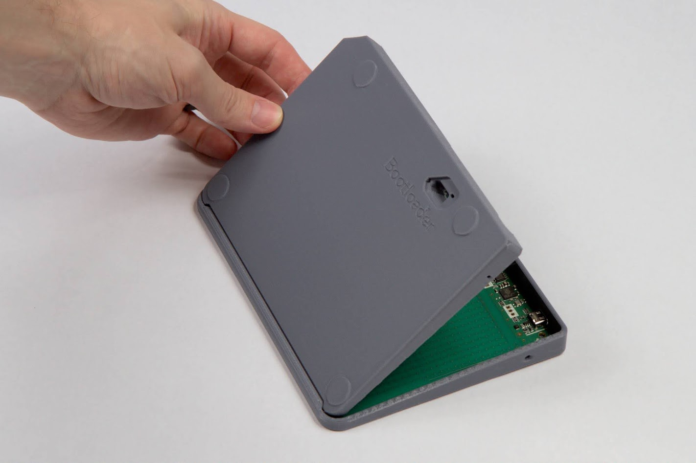
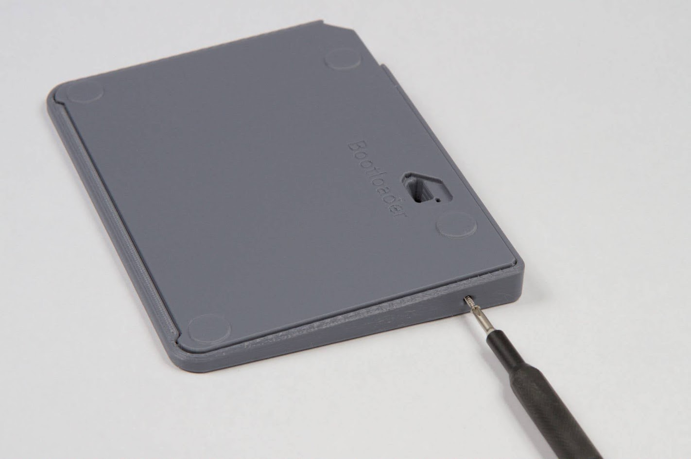

# Ploopy Kit Assembly Instructions

## BEFORE YOU DO ANYTHING, READ THIS FIRST.

**Do not flash new firmware until you've verified that the electronics are all working.**

That means, finish building the trackpad, plug it in, use the stock firmware for about five minutes. Verify that the cursor is moving, and all the buttons are working.

Once you've verified that it all works, you're good to go flashing new firmware.

## Main Instructions

In this section, you'll go over how to build a Trackpad from the official Ploopy Trackpad kit.

Here's how these instructions are structured*:

- 💡 Comments with a lightbulb are good information to know.
- ➡️ Comments with an arrow are commands. Execute them when you encounter them.
- ✅ Comments with a checkmark are verification steps. Check what they tell you to check, and if it's all good, move on.
- 📷 Comments with a camera are references to photos. Check the corresponding image for guidance.

Most steps have photos, so if you need some additional visual help, consult the images.

Note that some of these pictures were taken at different times, so they may show a bit of inconsistency in between steps.

*\* Thanks to [schneems](https://github.com/schneems) for his [great suggestions on how to write documentation](https://github.com/ploopyco/headphones/issues/37).*

### Step 1

- ➡️Get a #1 Phillips head screwdriver (or similar; you're looking for a small-ish screwdriver here).
- ➡️Get pair of pliers.
- 💡A pair of tweezers are optional, but they'll make future steps easier.

|  |
|:--:|
| *Figure 1: Necessary tools* |

### Step 2

- 💡 In the photo, a "tab" is being pulled by a pair of pliers.
- 💡 There may be up to two small tabs on the outside of the PCB.
- 💡 A pair of pliers will help to gently break the tabs off.
- ➡️ Break any leftover tabs off the PCB.

|  |
|:--:|
| *Figure 2: Breaking off tabs* |

### Step 3

- 💡 It's possible that there is a large air bubble in the tape on the PCB. When we say a *large air bubble*, we mean a bubble that is 5 millimeters in diameter or larger.
- ✅ Check the tape. Is there a large air bubble in the tape? If there is, continue with the rest of Step 3. If there is not, continue to Step 4.
- 💡 Note the location of the electronic components on the PCB.
- ➡️ Get the PCB and Back.
- 💡 The PCB doesn't require any pressure to put into the Back.
- ➡️ Place the PCB into the Back. 📷 *See Figure 3.1 and Figure 3.2 for details.*
- ✅ Check that the PCB is fully flat against the Back.
- 💡 The air bubble can be removed either by pushing the bubble to the edge of the tape, or by flattening the tape against the PCB so hard that the bubble compresses.
- ➡️ Use your fingers to push the air bubble out from underneath the tape.
- ➡️ Lift the PCB off the Back.
- ✅ Check the tape. Are there any more large air bubbles in the tape? If there are, repeat Step 3. If there aren't, continue to Step 4.

|  |
|:--:|
| *Figure 3.1: Aligning PCB with Back* |

|  |
|:--:|
| *Figure 3.2: PCB correctly aligned with Back* |

|  |
|:--:|
| *Figure 3.3: Pressing tape into PCB* |

### Step 4

- 💡 This step is meant to get you familiar with placing the PCB to the Front.
- ➡️ Get the PCB and Front. 📷 *See Figure 4.1.*
- ➡️ Do NOT peel the cover off of the tape on the PCB.
- ➡️ Place the PCB into the Front. 📷 *See Figure 4.2.*
- ✅ Check that the USB port lines up with the hole in the Front, and that the PCB is sitting flat against the Front. 📷 *See Figure 4.3.*
- ✅ Do you feel comfortable with the motion of placing the PCB into the Front? If so, move on. If not, repeat this step.
- ➡️ Remove the PCB from the Front.

|  |
|:--:|
| *Figure 4.1: PCB and Front* |

|  |
|:--:|
| *Figure 4.2: PCB being placed into Front* |

|  |
|:--:|
| *Figure 4.3: PCB placed correctly, with PCB sitting flat and USB port lined up with hole* |

### Step 5

- 💡 THIS IS AN EXTREMELY IMPORTANT STEP. It can only be tried once. Read this entire step fully, and make yourself comfortable with it. It isn't hard, but you only get one shot. Only execute it when you feel ready.
- 💡 When you peel the cover off of the tape, the peeling action may cause some of the tape itself to lift off. Try to avoid this as much as you can. If too much tape is peeling off, stop and try peeling the cover from a new corner.
- 💡 Avoid touching the tape once it's peeled and exposed.
- ➡️ Peel the cover tape off.
- ➡️ Place the PCB into the Front, just like you practiced in the previous step.
- ✅ Check that the USB port lines up with the hole in the Front, and that the PCB is sitting flat against the Front.

|  |
|:--:|
| *Figure 5: Cover tape being peeled* |

### Step 6

- 💡 The tape that is between the PCB and the Front is *pressure-activated*. This means that it will achieve full strength only when a significant amount of pressure is applied to the tape.
- ➡️ Use your fingers to press the PCB into the Front, hard. 📷 *See Figure 6.*

|  |
|:--:|
| *Figure 6: PCB being pressed into Front* |

### Step 7

- ➡️ Get the Back. 📷 *See Figure 7.1.*
- 💡 Note the lip on the bottom of the Front.
- 💡 It might require a bit of force to press the Back into the assembly.
- ➡️ Place the Back into the assembly. 📷 *See Figure 7.2 and Figure 7.3.*

|  |
|:--:|
| *Figure 7.1: Back and assembly* |

|  |
|:--:|
| *Figure 7.2: Back being placed into assembly* |

|  |
|:--:|
| *Figure 7.3: Back being gently pushed into assembly* |

### Step 8

- ➡️ Get three screws.
- ➡️ Insert the three screws into the three holes in the Front. 📷 *See Figure 8.1, Figure 8.2 and Figure 8.3.*

|  |
|:--:|
| *Figure 8.1: Top screw being driven* |

|  |
|:--:|
| *Figure 8.2: Left screw being driven* |

|  |
|:--:|
| *Figure 8.3: Right screw being driven* |

### Step 9

- ➡️ Get the Bootloader Cap and a screw.
- ➡️ Place the Bootloader Cap into the Back.
- ➡️ Screw the Bootloader Cap into the Back.

|  |
|:--:|
| *Figure 9: Bootloader cap being screwed down* |

### Step 10

- ➡️ Get the friction pads.
- ➡️ Peel and stick the friction pads onto the Back.

|  |
|:--:|
| *Figure 10.1: Friction pad being stuck* |

|  |
|:--:|
| *Figure 10.2: Friction pads completed* |

### Step 11

- ➡️ Get the Stylus.
- ➡️ Insert the Stylus into the Back.

|  |
|:--:|
| *Figure 11: Stylus being inserted into back* |

### Step 12

- ➡️ Plug the Trackpad into your computer.
- ✅ Check that moving your finger along the surface of the Trackpad moves the cursor.

### Step 13

- 💡 Congrats, you finished building the Ploopy Trackpad!
- 💡 It's done! Love it, use it, but don't you dare abuse it!

|  |
|:--:|
| *Figure 13: You're done!* |

